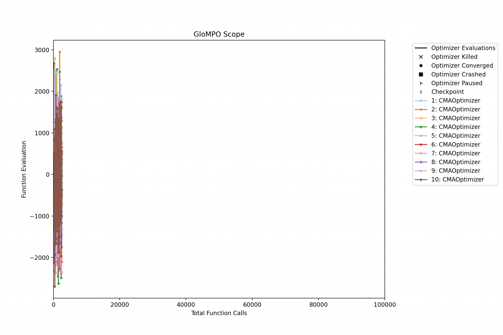

######################################
Globally Managed Parallel Optimization
######################################

************
Introduction
************

.. include:: ../README.rst
   :start-after: describe-start
   :end-before: describe-end

.. For a detailed description of GloMPO's architecture, please see ...

The user is advised to first work through the introduction and then the examples which give a good introduction to the GloMPO package and its components before diving deeper into the rest of the documentation.

*****************
Table of Contents
*****************

.. toctree::
   :maxdepth: 2

   installation
   examples
   tasks/tasks
   logging
   parallelism
   components/components
   analysis/analysis
   userinterventions
   outputs
   backmatter

******************
Indices and tables
******************

* :ref:`genindex`
* :ref:`modindex`
* :ref:`search`
