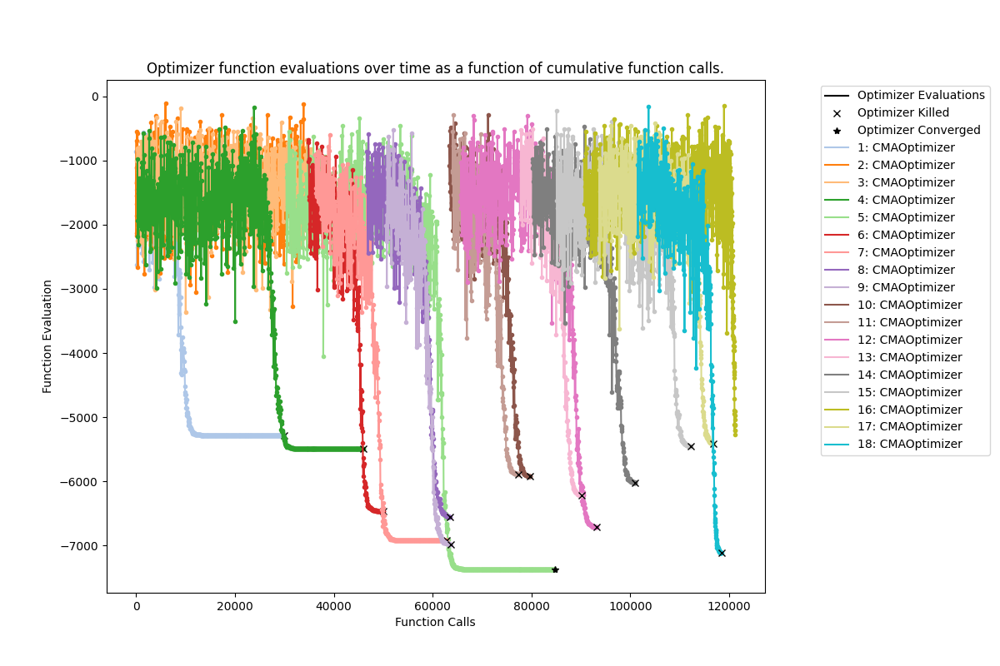

*******
Outputs
*******

GloMPO produces various types of results files which can be configured via the :class:`.GloMPOManager`; all or none of
them can be produced. A summary human-readable YAML file is the most basic record of the optimization. Image files of
the optimizer trajectories can also produced, as well as a compressed HDF5 file with all trajectory data and
optimization metadata.

Several other outputs are also produced depending on the configuration of the optimization and the optimizers.

Real-Time Status Reports
************************

GloMPO supports real-time status logging of an optimization. This can be directed to a file or the console (see
:ref:`Logging Messages`).

Printstreams
************

Often optimizers will have been implemented by other developers and its :class:`.BaseOptimizer` class will simply be a
wrapper around this code rather than a new implementation of the algorithm. In such circumstances, it is likely that
these optimizers will incorporate print statements in their code. When GloMPO runs multiple optimizers in parallel, this
can create an illegible console output as statements from different optimizers shuffle together. It also makes any
GloMPO logging messages a user may have setup, very difficult to follow and parse.

For this reason, the :attr:`.GloMPOManager.split_printstreams` option is provided which automatically redirects
optimizer print statements to separate ``printstream_xxxx.out`` text files. Errors are similarly redirected to
``printstream_xxxx.err`` files. ``xxxx`` is the four digit representation of each optimizer's unique
identification number. All these files are stored in the ``glompo_optimizer_printstreams`` directory created in
:attr:`.GloMPOManager.working_dir`.

.. note::

   If your optimizers can be silenced in another way or do not contain print statements, it is better to use
   :code:`split_printstreams = False` when initializing the manager. This avoids creating a large number of empty files.

Checkpoints
***********

GloMPO supports creating 'snapshots' of the optimization in time. The checkpoint files are compressed into a single
tarball from which the optimization can be resumed (see :ref:`Checkpointing`).

Python Result Object
********************

:meth:`.GloMPOManager.start_manager` returns a :class:`.Result` object with the final minimization result and some
basic optimization metadata. This allows a user to continue some operations after an optimization within the same
script.

Manager Summary File
********************

The most informative, human-readable, GloMPO output is the ``glompo_manager_log.yml`` file (produced by
:attr:`.GloMPOManager.summary_files` :math:`\geq` 1). An example of which can be downloaded
:download:`here <_static/glompo_manager_log.yml>` and seen below. It includes all GloMPO settings, the final result,
computational resources used, checkpoints created, as well as time and date information. These files can also be loaded
by YAML at a later stage and their contents accessed like a dictionary.

.. important::

   The manager summary file includes information about CPU usage, memory usage and system load. This is useful traceback
   to ensure the function is being parallelized correctly. It is important to note that CPU usage and memory usage is
   provided at a *process level*, system load is provided at a *system level*. This means that the system load
   information will only be of use if GloMPO is the only application running over the entire system. In distributed
   computing systems where GloMPO is only given access to a portion of a node, this information will be useless as it
   will be conflated with the usage of other users.

   The quality of this output is limited by the :doc:`psutil <psutil:index>` version installed in the python environment
   and various system limitations detailed in that package's documentation.

.. literalinclude:: _static/glompo_manager_log.yml

Plots
*****

The best way to get a overall sense of how the optimization proceeded is by using the summary trajectory plots (produced
by :attr:`.GloMPOManager.summary_files` :math:`\geq` 2). This requires :doc:`matplotlib <matplotlib:index>`. Two plots
are produced: ``trajectories.png`` and ``trajectories_best.png``. The former shows the actual function evaluation
results and the latter shows the best optimizer value. Below is an example of such a trajectory plot:

Optimizer Trajectory Log File
*****************************

The most detailed output is stored in a compressed HDF5 file (produced by
:attr:`.GloMPOManager.summary_files` :math:`\geq` 3). This includes all iteration and metadata information from
the optimizers themselves. This is more flexible and user-friendly than the previous YAML files created by GloMPO
:math:`<` v3.0. This file also contains all the manager metadata; in this way all information from an optimization can
be accessed from one location. To work with these files within a Python environment, we recommend loading it with
:doc:`PyTables <tables:index>`. To explore the file in a user-friendly GUI, we recommend using the
`vitables <https://pypi.org/project/ViTables/>`_ package.

It is within this HDF5 file that :meth:`.BaseFunction.detailed_call` information is saved if this is being
used.

HDF5 log files have the following structure:

.. code-block:: text

   glompo_log.h5
   |   This object contains manager and general optimization metadata in its attributes object.
   |
   +-- optimizer_1
   |   |   This contains optimizer specific metadata in its attributes object.
   |   |
   |   +-- messages
   |   |      An array of strings each representing a message send by the optimizer to the manager.
   |   |
   |   +-- iter_history
   |           A table of iterations results from the optimizer with the following columns:
   |              call_id
   |                 Unique iteration identifier across the entire optimization.
   |                 The universal function evaluation number.
   |              x
   |                 Input space vectors.
   |              fx
   |                 Function results.
   |              <others>
   |                 Extras if the detailed_call method is used and returns extra information
   |
   +-- optimizer_2
   |   +-- messages
   |   +-- iter_history
   +-- optimizer_3
   |   +-- messages
   |   +-- iter_history
   .
   .
   .

Logger Classes
==============

Within the GloMPO framework, the iteration history is tracked by a :class:`.BaseLogger` or a :class:`.FileLogger`. A
:class:`.BaseLogger` holds all information in memory only, for hunting and other GloMPO decision making; used when an
HDF5 log file has not been requested by the user.

In contrast, a :class:`.FileLogger` (which is a child of :class:`.BaseLogger`) maintains records in memory (for fast
access) while simultaneously writing data to file during the optimization.

Neither of these classes should ever need to be accessed directly by users. They are setup and controlled directly by
the :class:`.GloMPOManager`, but their documentation is provided here for reference.

.. autoclass:: glompo.core.optimizerlogger.BaseLogger
   :members:
   :special-members: __len__, __contains__

.. autoclass:: glompo.core.optimizerlogger.FileLogger
   :members:
   :show-inheritance:
   :exclude-members: checkpoint_save, get_history, get_metadata, has_iter_history, len, n_optimizers, put_iteration, put_message, put_metadata